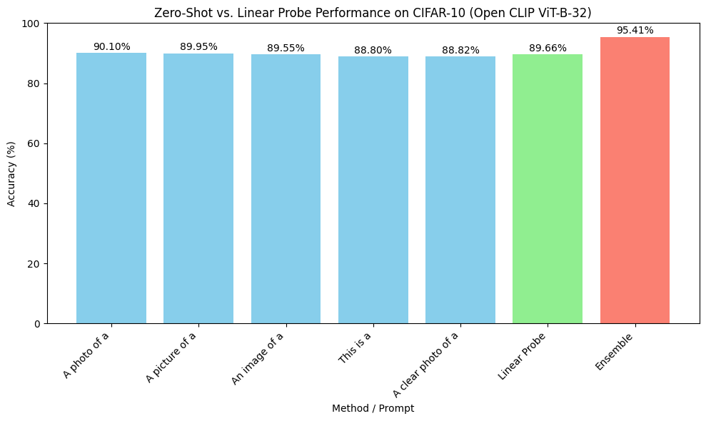

# CIFAR-10 CLIP Comparison Application

This application evaluates the performance of Open CLIP ViT-B-32 on the CIFAR-10 dataset using zero-shot classification and linear probe classification. It compares zero-shot accuracies for multiple prompt templates, an ensemble of prompts, and linear probe accuracy, visualized with a bar plot and table.

## Features
- **Zero-Shot Classification**: Evaluates accuracy for user-specified prompt templates (e.g., "a photo of a {}").
- **Ensemble Classification**: Computes accuracy by averaging text embeddings from multiple prompts.
- **Linear Probe Classification**: Trains a logistic regression model on CLIP image features.
- **Visualization**: Generates a bar plot (`cifar10_comparison.png`) and table comparing accuracies.

## Example Output
Below is an example of the bar plot comparing zero-shot, ensemble, and linear probe accuracies:



## Prerequisites
- Python 3.8 or higher
- A CUDA-compatible GPU (recommended for faster computation)
- Google Colab for notebook-based execution (optional)

## Installation
1. **Clone the Repository** (if applicable):
   ```bash
   git clone https://github.com/alephhNull/Zero-Shot-CLIP.git
   cd Zero-Shot-CLIP
   ```

2. **Install Dependencies**:
   Create a virtual environment and install the required packages:
   ```bash
   python -m venv venv
   source venv/bin/activate  # On Windows: venv\Scripts\activate
   pip install -r requirements.txt
   ```

3. **Verify GPU Availability** (optional):
   Ensure PyTorch detects your GPU:
   ```python
   import torch
   print(torch.cuda.is_available())
   ```

## Usage
### Local Environment
Run the application with command-line arguments to specify prompts and other parameters:
```bash
python cifar10_clip_comparison.py --prompts "a photo of a {}" "a picture of a {}" "an image of a {}" --batch_size 128 --data_dir ./data --encoder ViT-B-32 --checkpoint laion2b_s34b_b79k
```

**Arguments**:
- `--prompts`: List of prompt templates for zero-shot classification (default: ["a photo of a {}", "a picture of a {}", "an image of a {}"]).
- `--batch_size`: Batch size for data loading (default: 128).
- `--data_dir`: Directory for CIFAR-10 data (default: "./data").
- `--encoder`: CLIP encoder type (default: "ViT-B-32").
- `--checkpoint`: Pretrained checkpoint (default: "laion2b_s34b_b79k").

**Output**:
- Console: Zero-shot, ensemble, and linear probe accuracies, plus a table.
- File: `cifar10_comparison.png` (bar plot comparing accuracies).

### Google Colab
Try the application in the provided `demo.ipynb` notebook for a convenient experience:
1. Upload `cifar10_clip_comparison.py` and `demo.ipynb` to Colab.
2. Open `demo.ipynb` and run all cells to install dependencies and execute the script.
3. Modify the `args` dictionary in the notebook to customize prompts or parameters.

**Example `args` in `demo.ipynb`**:
```python
args = {
    'prompts': ['a photo of a {}', 'a picture of a {}', 'an image of a {}'],
    'batch_size': 128,
    'data_dir': './data',
    'encoder': 'ViT-B-32',
    'checkpoint': 'laion2b_s34b_b79k'
}
```

## Example Command
```bash
python cifar10_clip_comparison.py --prompts "this is a {}" "a clear photo of a {}" "an image of a {}"
```

## Example Output
- **Console**:
  ```
  Computing zero-shot accuracies...
  Zero-shot accuracy with prompt 'this is a {}': 64.50%
  Zero-shot accuracy with prompt 'a clear photo of a {}': 65.30%
  Zero-shot accuracy with prompt 'an image of a {}': 65.00%
  Ensemble accuracy: 66.50%
  Computing linear probe accuracy...
  Linear probe accuracy: 88.00%

  Results Table:
  +-----------------+----------------+------------+
  | Method          | Prompt         | Accuracy (%) |
  +-----------------+----------------+------------+
  | Zero-Shot       | This is        | 64.50      |
  | Zero-Shot       | Clear photo    | 65.30      |
  | Zero-Shot       | Image          | 65.00      |
  | Zero-Shot       | Ensemble       | 66.50      |
  | Linear Probe    | N/A            | 88.00      |
  +-----------------+----------------+------------+
  ```
- **Plot**: `cifar10_comparison.png` shows a bar plot with accuracies for each prompt, ensemble, and linear probe.

## Notes
- **Performance**: Zero-shot accuracies are typically 80-90%, ensemble slightly higher, and linear probe ~90-95%.
- **Running Time**: ~5-10 minutes for feature extraction, ~1-2 minutes for linear probe training on a Colab GPU (T4).
- **Customization**: Modify the `args` dictionary in `demo.ipynb` or command-line arguments to test different prompts or parameters.
- **Troubleshooting**: Ensure the `laion2b_s34b_b79k` checkpoint is available in `open_clip`. Check GPU availability in Colab (Runtime > Change runtime type > GPU).
